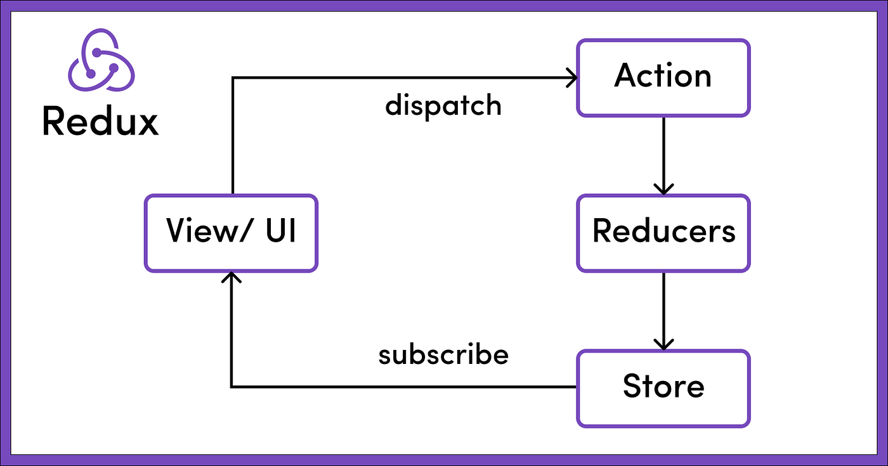

Link to redux documentation: https://redux.js.org/tutorials/essentials/part-1-overview-concepts

- What is Redux:
    1. GST(Global State Manager)

- Why/Where we use Redux? 
    1. useContext can become Complex.(Theme Management, Language, Authentication ...)
    2. Complex State Management

- Why Redux is performant
    1. Redux uses "caching" to rerender the component that has subsribed
    (If no changes were made into the store these components wont rerender).
    2. If we subscribe to a certain value from the store and that doesnt change while the store updates the component wont rerender.

  

- How Redux Works?
    1. Cental Data (State) Store
    2. Actions (Dispatch/trigger)
        dispatch({type: "authenticate user", value: {name:"foo", surname:"bar", token: "jb13btu13tb1f3"}})
    3. Will handle the logic based on the type of the action:
        const reducer = (action) => {
            let token = "";
            if(action.type === "authenticate user"){
                token = action.value.token
            }
        }
    4. Subscriber (An UI Component/Page can subscribe to multiple stores in order to get the last updated data.)

    
    

- What can go wrong while using only Redux:
    1. The logic into the reducer can grow while the application grows.
    2. It gets easier to run into an error or uexpected change since we have to return the entire state from each reducer action.(Even if we want to update a single value).
    3. Gets harder to maintain the code since the store accepts only one reducer function.

    Note:: If you are facing one of the above issues in your code it is a 
    good approach to start using Redux/toolkit.
    

- Why Redux/Toolkit is better
    1. It allows us to seperate the reducer into multiple slices.
    2. A slice is responsible for handling the actions for a specific topic for example (Authentication, Translation).
    3. This approach allows us to split the code and follow the principle of "seperation of concerns". This makes our code more readable, testable and maintainable.