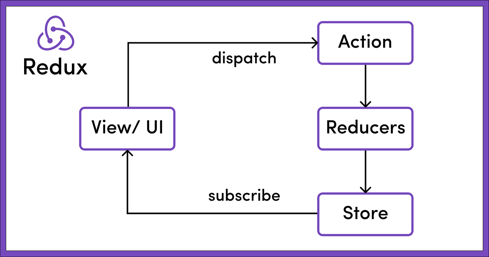

Link to redux documentation: https://redux.js.org/tutorials/essentials/part-1-overview-concepts

- What is Redux:
    1. GST(Global State Manager)

- Why/Where we use Redux? 
    1. useContext can become Complex.(Theme Management, Language, Authentication ...)
    2. Complex State Management

- Why Redux is performant
    1. Redux uses "caching" to rerender the component that has subribed
    (If no changes were made into the store these components wont rerender).

  

- How Redux Works?
    1. Cental Data (State) Store
    2. Actions (Dispatch/trigger)
        dispatch({type: "authenticate user", value: {name:"foo", surname:"bar", token: "jb13btu13tb1f3"}})
    3. Will handle the logic based on the type of the action:
        const reducer = (action) => {
            let token = "";
            if(action.type === "authenticate user"){
                token = action.value.token
            }
        }
    4. Subscriber (An UI Component/Page can subscribe to multiple stores in order to get the last updated data.)

    
    